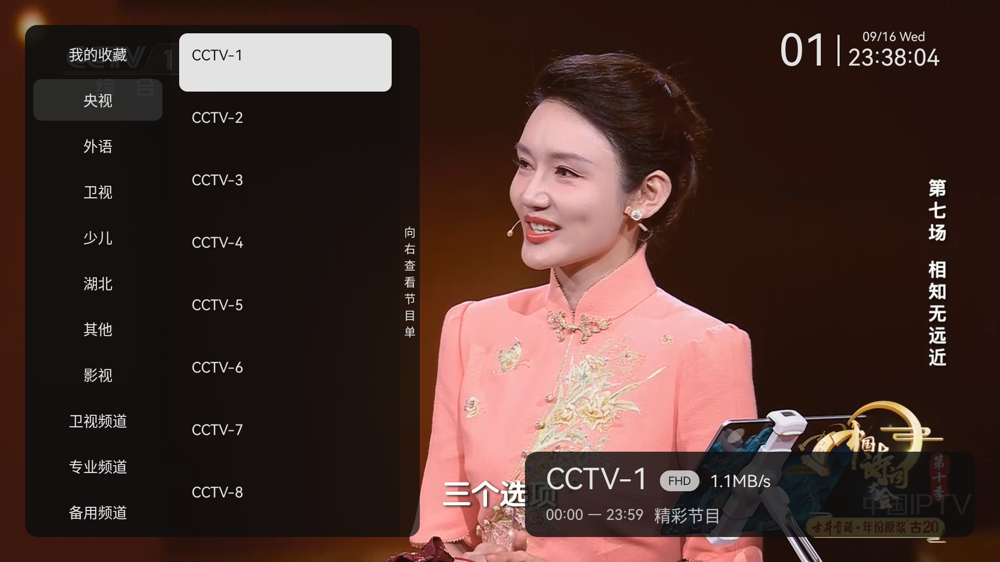
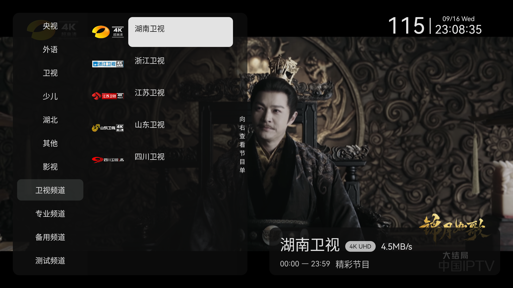

<div align="center">
  <h1>小骏TV</h1>
  <p>面向 Android TV 的开源 IPTV 直播播放器</p>
  <p>
    
    
    
  </p>
</div>



## 中文说明

小骏TV 是一款为电视大屏和遥控器设计的 IPTV 直播播放器。项目保留直播、频道分组、节目单和播放器切换功能，移除了更新推送、内置 HTTP 服务等非直播功能。

### 支持平台

| 平台 | 支持情况 |
| --- | --- |
| Android TV 5.0 及以上（API 21+） | 主版本，支持 `armeabi-v7a`、`arm64-v8a` |
| Android 4.3（API 18） | `tv-legacy` 兼容版本，适用于旧电视设备 |
| 小米电视等 Android TV 设备 | 已针对电视遥控器和大屏布局适配 |
| Android TV 模拟器 | 支持启动、遥控器焦点和基础播放测试 |

实际播放能力取决于电视硬件、系统解码器、网络质量和直播源格式。

### 播放内核

- MPV：支持软解和硬解配置
- VLC：适合电视设备和复杂直播流
- IJK：兼容旧设备
- Media3/ExoPlayer：支持 HLS、RTSP、DASH，并集成 FFmpeg 音频软解

### 本次修复与优化

- 修复切换播放器后频道自动跳回第一个节目。
- 修复播放器切换入口在主界面和设置界面无法生效的问题。
- 修复 VLC 播放 4K 内容时画面比例异常、被放大的问题。
- 修复 MPV 播放器初始化、软解/硬解配置和播放失败状态处理。
- 修复播放卡住或直播源加载超时时返回键无响应的问题。
- 增加播放失败、网络慢、无网络时的可恢复提示和重试入口。
- 增加返回键退出确认窗口，支持“确定退出”和“进入设置”。
- 修复电视遥控器 D-pad 焦点、频道菜单选中和频道切换交互。
- 增加经典选台界面、台标显示和节目单自动跟随直播源配置。
- 删除更新、推送、HTTP 服务等与直播无关的功能，减少后台请求和崩溃风险。
- 增加 Android 4.3 兼容模块和对应构建入口。

### 遥控器操作

- 上下键：切换频道或移动频道焦点
- 左右键：切换线路、打开节目单或移动菜单焦点
- OK：确认频道、打开控制菜单
- 返回：关闭当前菜单；播放页面再次按返回可打开退出确认
- 菜单/帮助键：打开设置或频道操作面板

### 构建

```bash
./gradlew :tv:assembleOriginalRelease
./gradlew :tv-legacy:assembleRelease
```

构建产物位于 `tv/build/outputs/apk/` 和 `tv-legacy/build/outputs/apk/`。GitHub Actions 会自动验证 Android TV 主版本和 Android 4.3 兼容版本。

## English

XiaojunTV is an open-source IPTV live streaming player designed for Android TV, large screens, and D-pad remotes. It keeps live channels, groups, EPG, and player switching while removing update notifications, push features, and the built-in HTTP service that are unrelated to live playback.

### Supported platforms

| Platform | Support |
| --- | --- |
| Android TV 5.0+ (API 21+) | Main application, `armeabi-v7a` and `arm64-v8a` |
| Android 4.3 (API 18) | `tv-legacy` compatibility build for older TVs |
| Xiaomi TV and similar Android TV devices | TV layout and remote navigation are supported |
| Android TV emulator | Startup, D-pad focus, and basic playback smoke tests |

Playback compatibility depends on the device hardware, system codecs, network quality, and stream format.

### Playback engines

- MPV with software and hardware decoding options
- VLC for TV devices and demanding live streams
- IJK for legacy device compatibility
- Media3/ExoPlayer with HLS, RTSP, DASH, and FFmpeg software audio decoding

### Fixes and improvements in this release

- Fixed channel selection resetting to the first channel after switching players.
- Fixed player switching from both the main screen and Settings.
- Fixed VLC 4K streams being displayed with an incorrect, enlarged aspect ratio.
- Improved MPV initialization, decoder selection, and playback failure handling.
- Prevented the app from becoming unresponsive when a stream times out or gets stuck.
- Added recoverable messages and retry actions for offline and slow-network states.
- Added a two-step Back flow with Exit and Settings actions.
- Fixed D-pad focus, channel menu selection, and channel switching on TV screens.
- Added the classic channel selector, channel logos, and source-linked EPG support.
- Removed update, push, and HTTP-service features unrelated to live playback.
- Added an Android 4.3 compatibility module and build target.

### Build

```bash
./gradlew :tv:assembleOriginalRelease
./gradlew :tv-legacy:assembleRelease
```

APK files are generated under `tv/build/outputs/apk/` and `tv-legacy/build/outputs/apk/`. GitHub Actions verifies both the Android TV build and the Android 4.3 compatibility build.

## Screenshots

| Channel selector | 4K channel selector | Full-screen playback |
| --- | --- | --- |
|  |  |  |

## Download / 下载

Release APKs are published on the [GitHub Releases](https://github.com/minx3599/xiaojuntv/releases) page.

## License

This project is for learning and testing. Please make sure that your live stream sources and displayed content comply with applicable laws and the rights of their respective owners. See [LICENSE](./LICENSE) for the project license.

## Acknowledgements

- [my-tv](https://github.com/lizongying/my-tv)
- [live](https://github.com/fanmingming/live)
- [mpv-android](https://github.com/mpv-android/mpv-android)
- [VLC](https://github.com/videolan/vlc)
